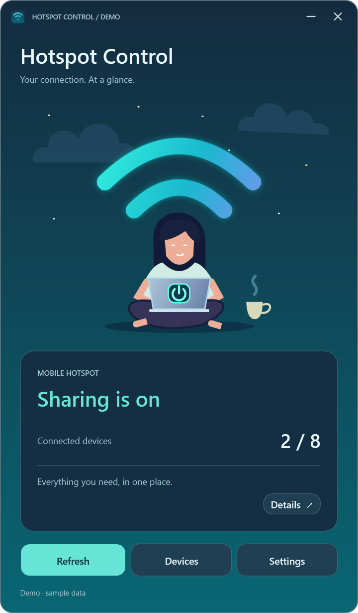
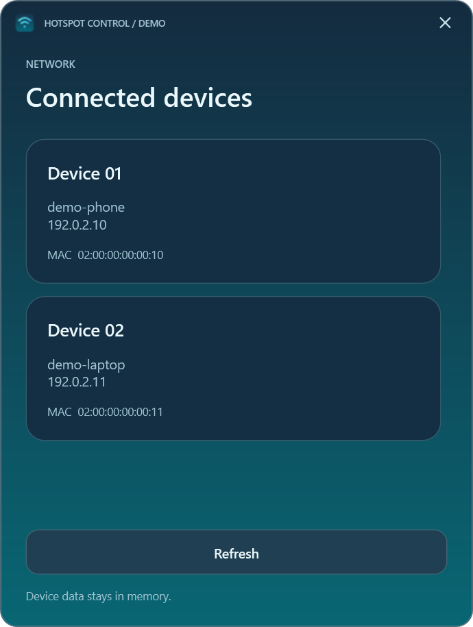
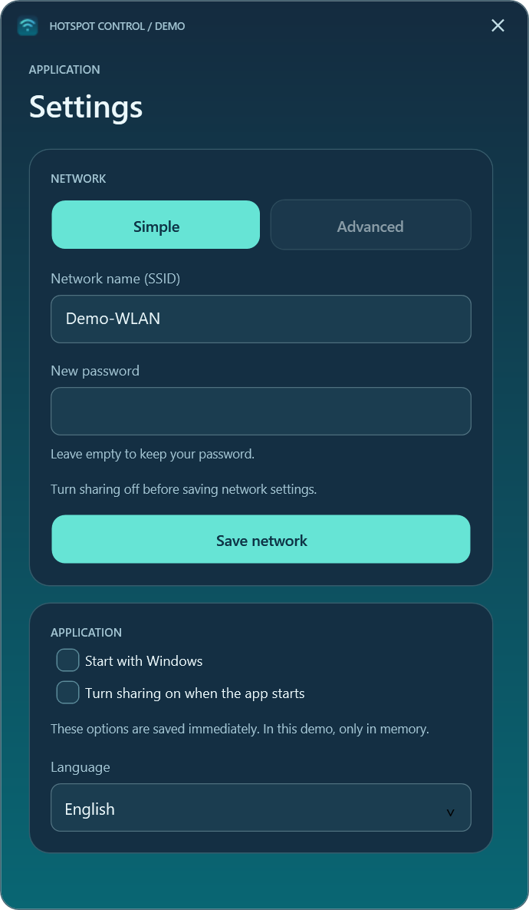
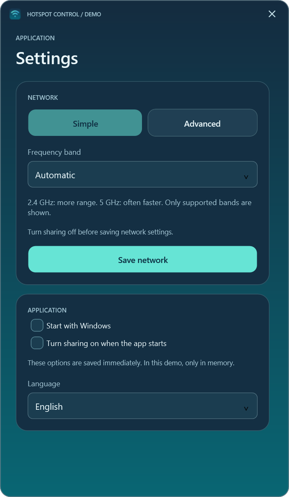
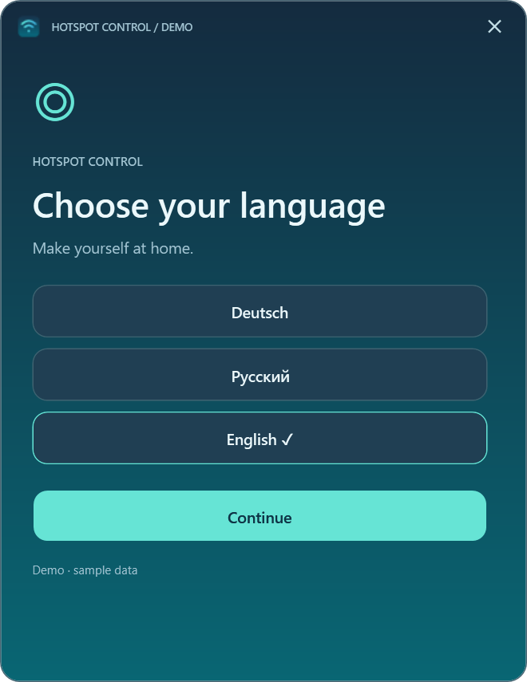
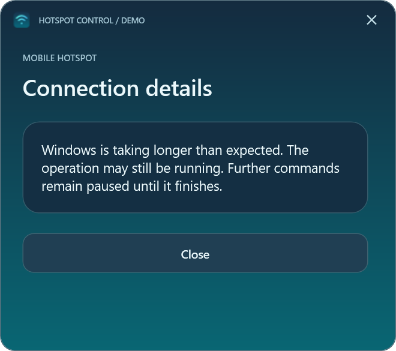

# Hotspot Control

[Deutsch](docs/README.de.md) · [Русский](docs/README.ru.md) · English

Hotspot Control is a compact Windows 11 app for the built-in Mobile Hotspot. It shows status and connected devices, controls sharing, and offers network and startup settings. The interface, errors and tray support German, Russian and English. Choose a language on first launch; later changes in Settings take effect after restarting.

## Screenshots

These WPF preview renders use fictional data. The app displays device names as Windows provides them; sample names, addresses and the `DEMO` marker are not explanatory copy. Language names in the language picker identify available choices.

| Main window | Connected devices |
|---|---|
|  |  |

| Simple settings | Advanced settings |
|---|---|
|  |  |

| Language selection | Timeout message |
|---|---|
|  |  |

## Download and use

Download `HotspotControl-0.3.0-win-x64.zip` from [Releases](https://github.com/popovantondev/HotspotControl/releases), verify its SHA-256 against the accompanying `.sha256` file, and extract the entire ZIP. Run `HotspotControl.App.exe` from the extracted folder. No installer, administrator rights, or separate .NET installation is required. Target: Windows 11 24H2 or newer, x64, with a compatible Wi-Fi adapter. Windows or organization policy may restrict operations. Practical testing so far is limited to the owner's computer.

The power button on the illustrated laptop starts or stops the hotspot. Stopping disconnects clients. **Devices** lists information provided by Windows. **Settings** changes the network name, password, supported band, language, and user-level startup options. Leave the new-password field empty to keep the current password. Network changes require the hotspot to be off. Minimize hides the app in the tray; click its icon to restore. Closing exits the app but leaves the Windows hotspot as it is. Green tray waves indicate sharing is on; gray waves indicate off or unknown.

Auto-enable at app start is optional. To inspect the app without it, launch `HotspotControl.App.exe --no-auto-start`. A timed-out Windows operation may still finish later; check the current status before another change. Per-client speed limiting is not supported.

## Privacy

The app has no cloud service, telemetry, or network-identity log. It stores language and the auto-enable choice in `%LOCALAPPDATA%\HotspotControl\preferences.json`; the Windows-start shortcut is in the current user's Startup folder. Passwords are not saved by this app. Remove personal network names, device addresses, and local paths from bug reports and screenshots. The image above uses fictional data.

## Build and verify

Use .NET 10 SDK on Windows. From this directory, run `./Run-Checks.ps1` and `./Publish.ps1`. Pass `-DotnetPath` to use another SDK executable. `Publish.ps1` creates a local self-contained ZIP and SHA-256 file under ignored `artifacts/`; it does not upload anything. The WPF design preview has no access to the real hotspot or preferences.

See [architecture](docs/ARCHITECTURE.md), [release notes](docs/RELEASE_0.3.0.md), [design preview](docs/PREVIEW.md), and [changelog](CHANGELOG.md). Reports for 0.2.0 describe that historical version.

## Rights

This repository does not offer an open-source license. The owner permits personal use of an unmodified release binary; public source visibility does not grant permission to reuse or redistribute the source. See [rights](RIGHTS.md) and [third-party notices](THIRD_PARTY_NOTICES.md). Feedback is welcome in German, Russian or English through GitHub Issues.
