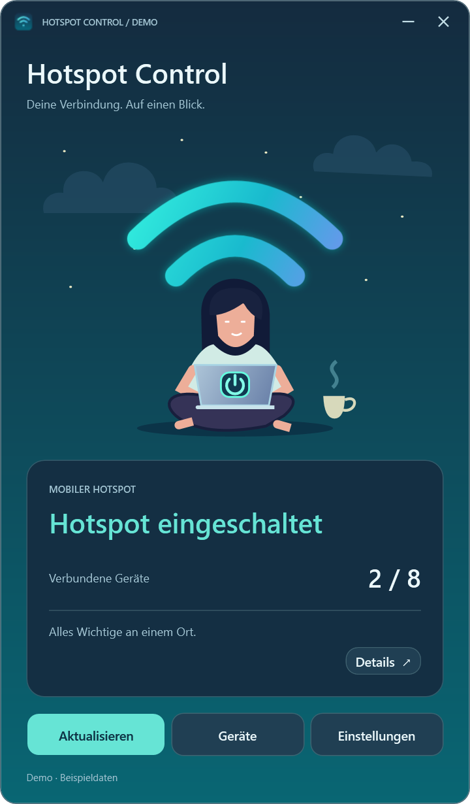
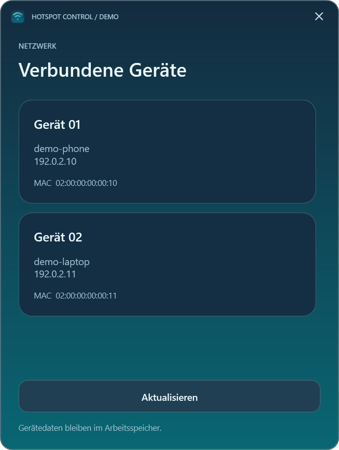
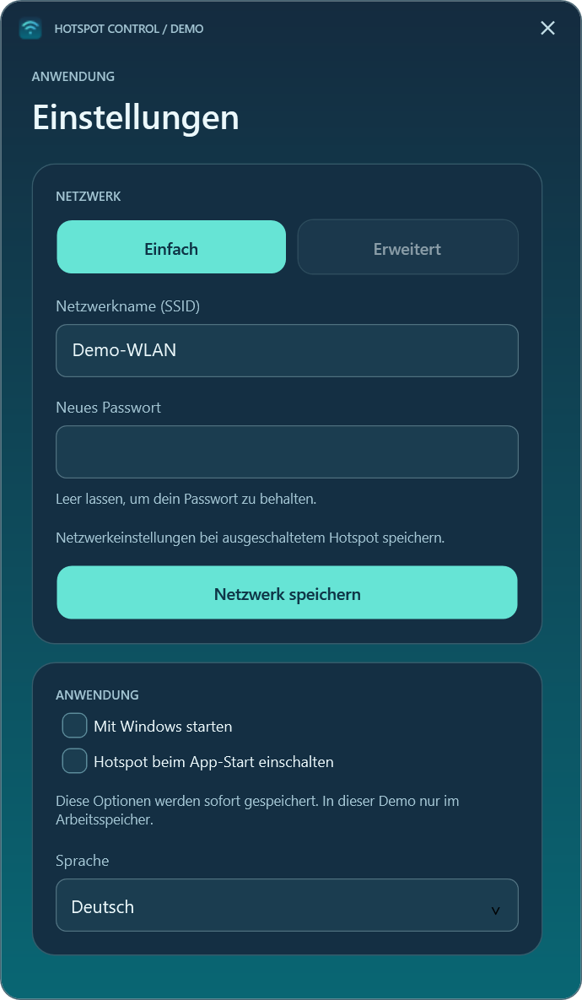
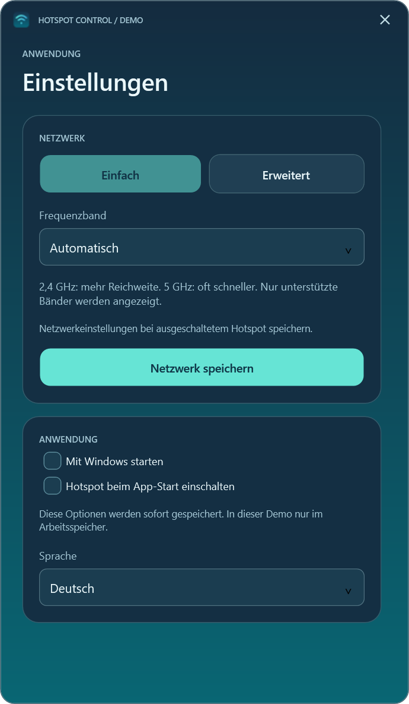
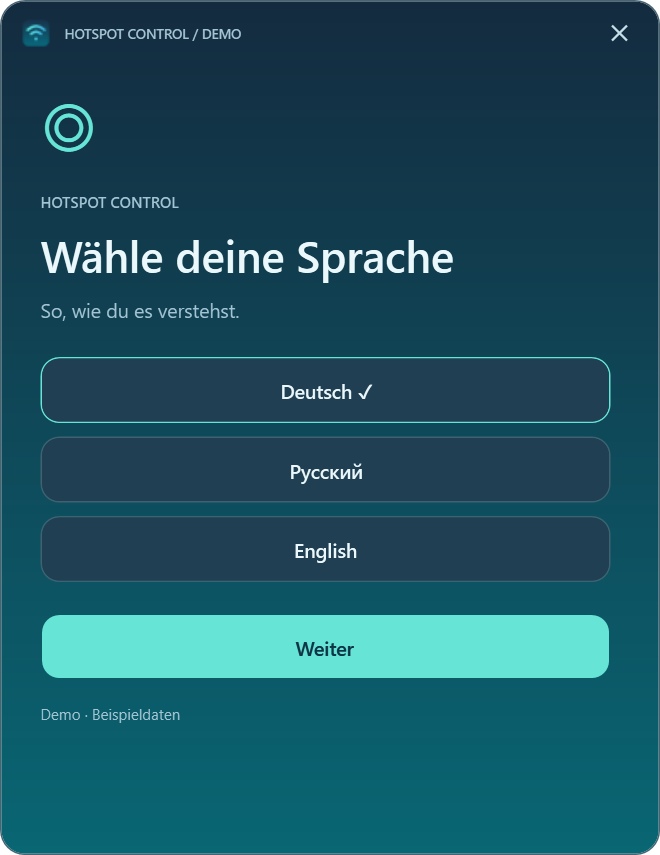
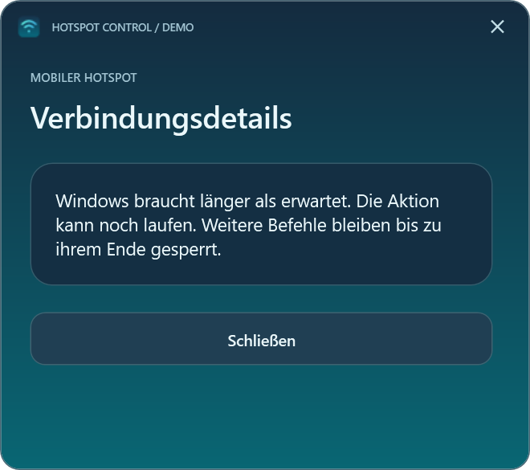

# Hotspot Control

<!-- public-release:start -->
Steuert den mobilen Windows-Hotspot und zeigt Geräte sowie Netzwerkeinstellungen.

**Windows 11 24H2+ · x64 · Release 0.3.0**

**[Herunterladen](https://github.com/popovantondev/HotspotControl/releases/tag/v0.3.0)** · **[Anleitung](https://popovantondev.github.io/HotspotControl/Guide-de.html)** · **[Fehler melden](https://github.com/popovantondev/HotspotControl/issues/new/choose)**

**Voraussetzungen und Grenzen:** Kompatibler WLAN-Adapter; Windows- oder Organisationsrichtlinien können Funktionen einschränken. .NET ist enthalten.

**Erste Schritte:** SHA-256 prüfen, ZIP vollständig entpacken und HotspotControl.App.exe öffnen. Keine separate .NET-Installation nötig.

**App-Dateien:**

- [`HotspotControl-0.3.0-win-x64.zip`](https://github.com/popovantondev/HotspotControl/releases/download/v0.3.0/HotspotControl-0.3.0-win-x64.zip)

**Prüfsummen:** [`HotspotControl-0.3.0-win-x64.zip.sha256`](https://github.com/popovantondev/HotspotControl/releases/download/v0.3.0/HotspotControl-0.3.0-win-x64.zip.sha256)
<!-- public-release:end -->

[English](../README.md) · Deutsch · [Русский](README.ru.md)

Hotspot Control ist eine kompakte Windows-11-Anwendung für den eingebauten mobilen Hotspot. Sie zeigt Status und verbundene Geräte, schaltet die Freigabe und bietet Netzwerk- und Autostarteinstellungen. Oberfläche, Fehler und Tray unterstützen Deutsch, Russisch und Englisch. Beim ersten Start wird die Sprache gewählt; spätere Änderungen in den Einstellungen gelten nach einem Neustart.

## Bildschirmansichten

Diese WPF-Vorschaubilder verwenden erfundene Daten. Gerätenamen zeigt die App so an, wie Windows sie liefert; Beispielnamen, Adressen und die Kennzeichnung `DEMO` sind keine Erklärungstexte. Die Sprachnamen im Sprachauswahldialog benennen die verfügbaren Optionen.

| Hauptfenster | Verbundene Geräte |
|---|---|
|  |  |

| Einfache Einstellungen | Erweiterte Einstellungen |
|---|---|
|  |  |

| Sprachauswahl | Zeitüberschreitung |
|---|---|
|  |  |

## Herunterladen und starten

`HotspotControl-0.3.0-win-x64.zip` von [Releases](https://github.com/popovantondev/HotspotControl/releases/tag/v0.3.0) laden, den SHA-256-Wert mit der `.sha256`-Datei vergleichen und das gesamte ZIP entpacken. Im entpackten Ordner `HotspotControl.App.exe` starten. Weder Installation noch Administratorrechte oder eine separate .NET-Installation sind nötig. Zielsystem: Windows 11 ab 24H2, x64, mit geeignetem WLAN-Adapter. Windows- oder Organisationsrichtlinien können Funktionen einschränken. Bisher wurde nur auf dem Computer des Eigentümers praktisch getestet.

Der Power-Knopf auf dem illustrierten Laptop schaltet den Hotspot ein oder aus; Ausschalten trennt verbundene Geräte. **Geräte** zeigt die von Windows gelieferten Angaben. **Einstellungen** bietet Netzwerkname, neues Passwort, unterstütztes Frequenzband, Sprache und benutzerbezogenen Autostart. Ein leeres Passwortfeld behält das bisherige Passwort. Netzwerkänderungen erfordern einen ausgeschalteten Hotspot. Minimieren blendet das Fenster in den Infobereich aus; ein Klick auf das Symbol stellt es wieder her. Schließen beendet die App, ohne den Windows-Hotspot zu ändern. Grüne Wellen bedeuten eingeschaltet; graue ausgeschaltet oder unbekannt.

Der automatische Hotspotstart ist optional. Mit `HotspotControl.App.exe --no-auto-start` lässt sich die App ohne diese Automatik öffnen. Ein Windows-Auftrag kann nach einem Timeout noch fertig werden; vor weiteren Änderungen den Status prüfen. Eine Geschwindigkeitsbegrenzung pro Gerät gibt es nicht.

## Datenschutz und Entwicklung

Keine Cloud, Telemetrie oder lokalen Protokolle mit Netzwerknamen und Geräteadressen. Sprache und automatische Aktivierung stehen in `%LOCALAPPDATA%\HotspotControl\preferences.json`; die Windows-Start-Verknüpfung liegt im Autostartordner des Benutzers. Die App speichert keine Passwörter. In Fehlerberichten und Screenshots persönliche Daten entfernen. Das Bild oben nutzt erfundene Daten.

Zum Bauen ist das .NET-10-SDK auf Windows nötig: `./Run-Checks.ps1` und `./Publish.ps1`. Mit `-DotnetPath` kann ein anderes SDK gewählt werden. Das Skript erstellt ZIP und SHA-256 lokal unter `artifacts/`; es lädt nichts hoch.

Der Quelltext hat keine Open-Source-Lizenz. Persönliche Nutzung der unveränderten Release-Binärdatei ist erlaubt. [Architektur](ARCHITECTURE.de.md) · [Versionshinweise](RELEASE_0.3.0.de.md) · [Vorschau](PREVIEW.de.md) · [Änderungen](../CHANGELOG.de.md) · [Nutzungsrechte](../RIGHTS.de.md) · [Drittanbieterhinweise](../THIRD_PARTY_NOTICES.de.md).
