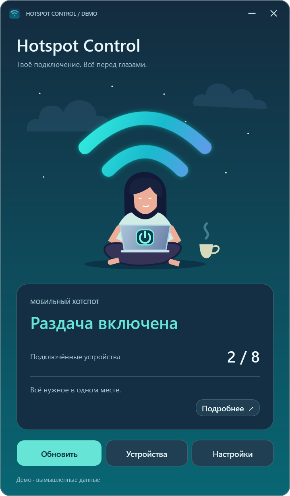
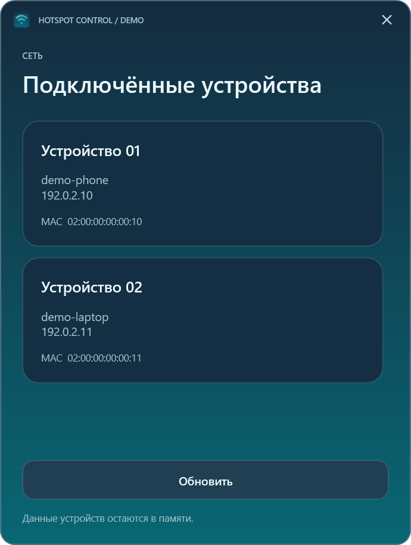
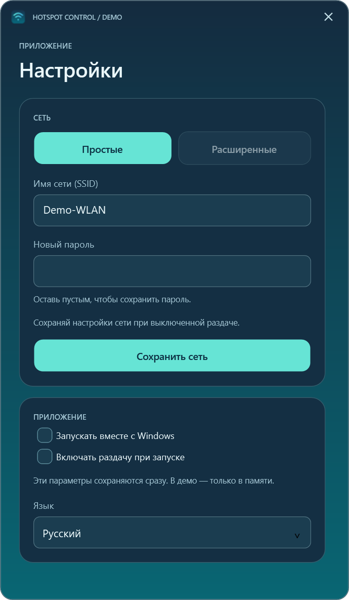
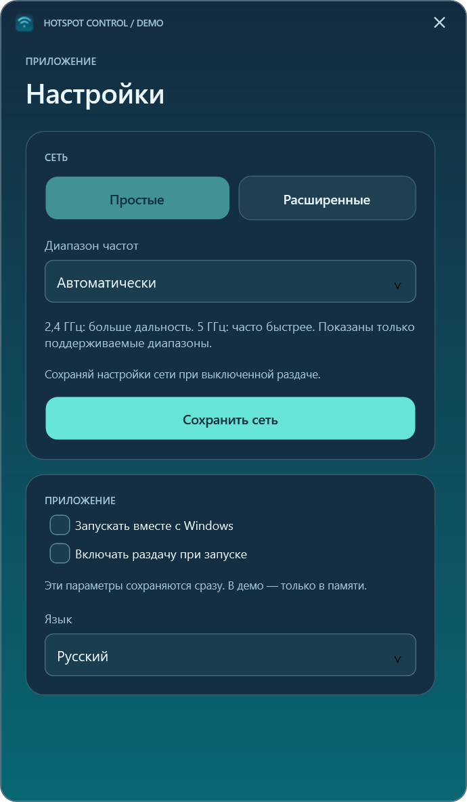
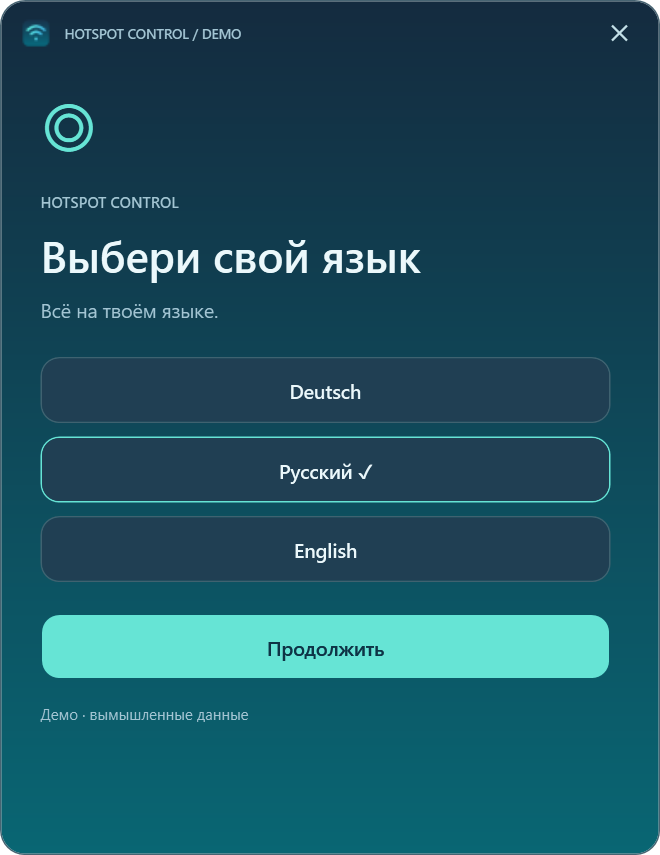
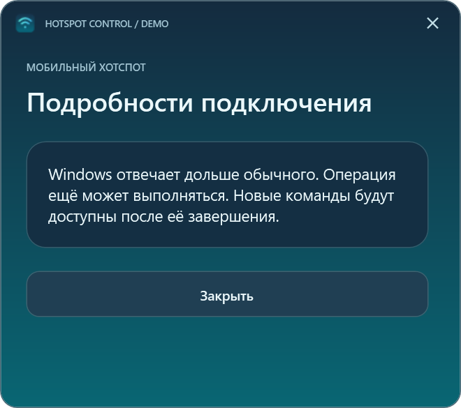

# Hotspot Control

[English](../README.md) · [Deutsch](README.de.md) · Русский

Hotspot Control — компактное приложение для встроенной мобильной точки доступа Windows 11. Оно показывает состояние и подключённые устройства, управляет раздачей и предлагает настройки сети и автозапуска. Интерфейс, ошибки и трей доступны на немецком, русском и английском. Язык выбирается при первом запуске; последующая смена в настройках применяется после перезапуска.

## Скриншоты

Эти рендеры WPF-превью используют вымышленные данные. Приложение показывает имена устройств так, как их передаёт Windows; примеры имён, адреса и отметка `DEMO` — это не поясняющие тексты интерфейса. Названия языков в окне выбора обозначают доступные варианты.

| Главное окно | Подключённые устройства |
|---|---|
|  |  |

| Простые настройки | Расширенные настройки |
|---|---|
|  |  |

| Выбор языка | Сообщение о тайм-ауте |
|---|---|
|  |  |

## Загрузка и запуск

Скачайте `HotspotControl-0.3.0-win-x64.zip` из [Releases](https://github.com/popovantondev/HotspotControl/releases), сравните SHA-256 с приложенным файлом `.sha256` и полностью распакуйте архив. Запустите `HotspotControl.App.exe` из распакованной папки. Установка, права администратора и отдельная установка .NET не нужны. Целевая система: Windows 11 24H2 и новее, x64, с подходящим Wi-Fi-адаптером. Политики Windows или организации могут ограничивать функции. Практические испытания пока проводились только на компьютере владельца.

Кнопка питания на нарисованном ноутбуке включает и выключает раздачу; выключение отключает клиентов. **Устройства** показывает данные, полученные от Windows. **Настройки** позволяют изменить имя сети, пароль, поддерживаемый диапазон, язык и автозапуск для текущего пользователя. Пустое поле нового пароля сохраняет прежний пароль. Для изменения параметров сети точка доступа должна быть выключена. Сворачивание скрывает окно в трее; щелчок по значку возвращает его. Закрытие завершает приложение, не меняя состояние точки доступа. Зелёные волны означают включённую раздачу; серые — выключенную или неизвестное состояние.

Автовключение при запуске необязательно. `HotspotControl.App.exe --no-auto-start` открывает приложение без него. После тайм-аута операция Windows всё ещё может завершиться: перед следующим действием проверьте состояние. Ограничение скорости отдельных устройств не поддерживается.

## Конфиденциальность и сборка

Нет облака, телеметрии и локальных журналов с именами сетей или адресами устройств. Язык и настройка автовключения хранятся в `%LOCALAPPDATA%\HotspotControl\preferences.json`; ярлык запуска с Windows находится в папке автозагрузки пользователя. Приложение не сохраняет пароли. Удаляйте личные данные со скриншотов и из сообщений об ошибках. Изображение выше содержит вымышленные данные.

Для сборки нужен .NET 10 SDK на Windows: `./Run-Checks.ps1` и `./Publish.ps1`. Другой SDK можно передать через `-DotnetPath`. Скрипт создаёт ZIP и SHA-256 локально в `artifacts/` и ничего не загружает.

Исходный код не распространяется под открытой лицензией. Разрешено личное использование неизменённой бинарной версии. [Архитектура](ARCHITECTURE.ru.md) · [Релиз 0.3.0](RELEASE_0.3.0.ru.md) · [Превью](PREVIEW.ru.md) · [Изменения](../CHANGELOG.ru.md) · [Права](../RIGHTS.ru.md) · [Сторонние компоненты](../THIRD_PARTY_NOTICES.ru.md).
